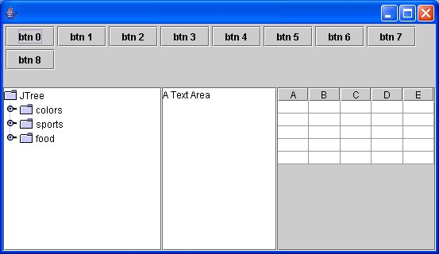

# My First Application 

In this first lesson, you will create your first Java Swing application using the VLDocking Framework.

## Application description

The Swing application we are going to create is very simple, it will be composed of 4 dockables :

* a Dockable for a text editor component.
* a Dockable for a JTree component
* a Dockable for a grid of buttons
* and finally, a Dockable for a JTable

This application being a kind of "Hello World", don't expect to get something useful from it (excepted your first knowledge of the framework).

## Creating the application components

We will start writing down our Application components (the "GUI blocks"), then we'll transform them into dockables.

### The TextEditor component

This component is a JPanel containing a JScrollPane, containing a JTextArea.
We start with a JPanel to be able to add other components inside later (a toolbar, for example).

```
    class MyTextEditor extends JPanel {
        JTextArea textArea = new JTextArea("A Text Area");
        MyTextEditor() {
            setLayout(new BorderLayout());
            JScrollPane jsp = new JScrollPane(textArea);
            jsp.setPreferredSize(new Dimension(300, 400));
            add(jsp, BorderLayout.CENTER);
        }
    }
```

### The JTree component
 
This component is a simple JTree, and like for TextEditor, we will start with a JPanel containing a JScrollPane, containing the JTree, for extension purposes.

```
    class MyTree extends JPanel {
        JTree tree = new JTree();
        MyTree() {
            setLayout(new BorderLayout());
            JScrollPane jsp = new JScrollPane(tree);
            jsp.setPreferredSize(new Dimension(200, 200));
            add(jsp, BorderLayout.CENTER);
        }
    }
```

### The Grid of Buttons component

This component simulates a palette window, or any command component used to modify, say, the TextEditor contents.

```
    class MyGridOfButtons extends JPanel {
        MyGridOfButtons() {
            setLayout(new FlowLayout(FlowLayout.TRAILING, 3, 3));
            for (int i = 0; i < 3; i++) {
                for (int j = 0; j < 3; j++) {
                    add(new JButton("btn" + (i * 3 + j)));
                }
            }
            setPreferredSize(new Dimension(200,300));
        }
    }

```

### The Table component

This component is a JPanel containing a JScrollPane, containing a JTable.

```
   class MyJTable extends JPanel {
      JTable table = new JTable();
      MyJTable() {
         setLayout(new BorderLayout());
         table.setModel(new DefaultTableModel(5, 5));
         JScrollPane jsp = new JScrollPane(table);
         jsp.setPreferredSize(new Dimension(200, 200));
         add(jsp, BorderLayout.CENTER);
      }
   }
```

## Creating the Frame


Our frame object will be a standard JFrame subclass, with a main() method for testing purposes.

```
public class Lesson00Frame extends JFrame {

    MyTextEditor editorPanel = new MyTextEditor();
    MyTree treePanel = new MyTree();
    MyGridOfButtons buttonGrid = new MyGridOfButtons();
    MyJTable tablePanel = new MyJTable();

    Lesson00Frame(){
        setDefaultCloseOperation(DISPOSE_ON_CLOSE);
        getContentPane().add(editorPanel, BorderLayout.CENTER);
        getContentPane().add(treePanel, BorderLayout.WEST);
        getContentPane().add(buttonGrid, BorderLayout.NORTH);
        getContentPane().add(tablePanel, BorderLayout.EAST);
    }

    static void main(String[] args){
        Lesson00Frame frame = new Lesson00Frame();
        frame.setSize(800,600);
        frame.validate();
        SwingUtilities.invokeLater(
            new Runnable(){
                // in the event dispatch thread
                public void run(){
                    frame.setVisible(true);
                }
            }
        );
    }
}
```

Launching this application should give us something like that :
 


This is the kind of frame layout a standard Swing application would have (although a little bit better, using JSplitPanes or JInternalFrames).

----

[Next ; And now ... Docking!](lesson-01.html)
