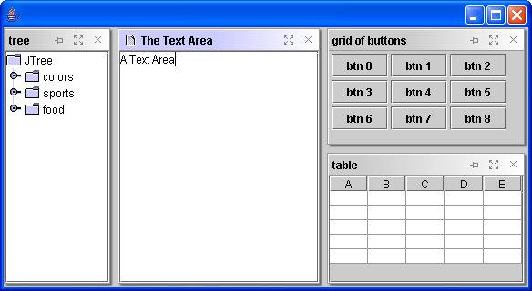
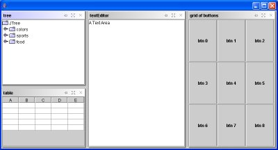
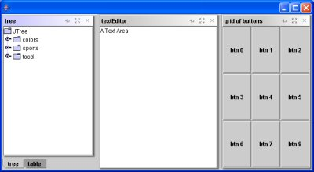
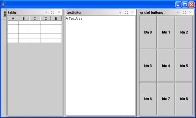

# Lesson 1 : My First Application  / And now ... Docking!


Here is the receipe to transform our application into a docking-enabled application :

- Have the GUI blocks (our four components) implement the Dockable interface
- Install a DockingDesktop on our Frame
- Add the dockables into the desktop.

So let's start...

## Implement the Dockable interface

The Dockable interface is simple : you just have two methods :

```
	public DockKey getDockKey();
	public Component getComponent();
```

The DockKey is the JavaBean that contains presentation and behaviour informations
about the dockable (name, icon, ...) and a special *key* field used as
a primary key for loading and saving (this field was formerly known as 'dockName' but
we have replaced it with a more comprehensive naming).

We will use the most simple constructor, which takes only one argument : key.

So let's look at one of the four GUI blocks and have it implement Dockable :

```
	class MyTextEditor extends JPanel *implements Dockable *{

		*DockKey key = new DockKey("textEditor");*

		JTextArea textArea = new JTextArea("A Text Area");
		public MyTextEditor() {
			setLayout(new BorderLayout());
			JScrollPane jsp = new JScrollPane(textArea);
			jsp.setPreferredSize(new Dimension(200, 400));
			add(jsp, BorderLayout.CENTER);
		}
		*public DockKey getDockKey(){
			return key;
		}
		public Component getComponent(){
			return this;
		}*
	}
```

As you can see, we have added an instance variable `key` to identify our component.
We also return `this` for the `getComponent()` method, which indicates that the Dockable IS the component.[^nonGUI]

We leave the implementation of Dockable on the three other components as an exercice to the reader.

## Install the DockingDesktop

This step is easy, just create an instance variable on the MyFirstFrame object:

```
*import com.vlsolutions.swing.docking.*;*

public class MyFirstFrame extends JFrame {
   MyTextEditor editorPanel = new MyTextEditor();
   MyTree treePanel = new MyTree();
   MyGridOfButtons buttonGrid = new MyGridOfButtons();
   MyJTable tablePanel = new MyJTable();

   *DockingDesktop desk = new DockingDesktop();*

   public MyFirstFrame(){
	  setDefaultCloseOperation(DISPOSE_ON_CLOSE);
	  *getContentPane().add(desk);* // desk becomes the only one component

	  // we'll update these in the next step
	  <s>getContentPane().add(editorPanel, BorderLayout.CENTER); </s>
	  <s>getContentPane().add(treePanel, BorderLayout.WEST);</s>
	  <s>getContentPane().add(buttonGrid, BorderLayout.NORTH);</s>
	  <s>getContentPane().add(tablePanel, BorderLayout.EAST);</s>
   }
}
```

## Build the desktop

There are two ways to build your desktop:

- Static : define and load a workspace with the help of the Workspace Editor application.
- Dynamic : invoke the API to create or update your desktop layout.

### The (dynamic) DockingDesktop API

The DockingDesktop uses a relative positionning API : Look at the following code and guess what it does...

```
  desk.addDockable(editorPanel);
  desk.split(editorPanel, treePanel, DockingConstants.SPLIT_LEFT);
  desk.split(editorPanel, buttonGrid, DockingConstants.SPLIT_RIGHT);
  desk.split(buttonGrid, tablePanel, DockingConstants.SPLIT_BOTTOM);
```

Here is a screenshot of the results:



Easy, isn't it?

Let's discuss what our options for twaeking it are.

## Docking layout methods

### The `addDockable` method

This method is used to set the initial component of the desktop.

### The `split` method

The `split(Dockable base, Dockable newDockable, DockingConstants.Split position)` method is used to position a dockable (`newDockable`) relative to another (the `base`), and with respect to a positionning (`DockingConstants.SPLIT_TOP, SPLIT_LEFT, SPLIT_BOTTOM, SPLIT_RIGHT`).

The `position` parameter designates the *orientation* and *order* of the added component (`SPLIT_TOP`, for example, means : split the `base` container vertically, and put the `newDockable` on the upper part).

### The `createTab` method

The `createTab(Dockable base, Dockable newDockable, int order)` method is used to put two (or more) dockables at the same position on the desktop by creating a tabbed pane.

If a tabbed pane is already created, a new tab is added at the `order` index.

### The `setAutoHide(Dockable d, boolean hidden)` method

`setAutoHide(Dockable d, boolean hidden)` is used to auto-hide an already visible dockable. So, you first add, split or createTab a dockable to display it, and then you hide it (that way, it will remember where to be displayed when docked again).

### The `setFloating(Dockable d, boolean floating)` method

`setFloating(Dockable d, boolean floating)` is used to detach a dockable and display it in its own window. If {{{float}}} is false, than the floating dockable is attached again to its desktop.

Making a dockable floating is allowed when the dockable is already visible and "docked", or if it is auto-hidden.

### The `maximize` and `restore` methods

These methods allow you to maximize a dockable (have it take the full size of its desktop, hiding the others dockable) and to put it back where it was before (restore). 

Making a dockable maximized is allowed when the dockable is already visible and "docked".

### The `addHiddenDockable` method

`addHiddenDockable(Dockable d, RelativeDockingPosition restorePosition)` is used to auto-hide a dockable that is not visible.

The RelativeDockingPosition defines a restore  position (x,y, width, height: values between 0.0 and 1.0) where the component  will be displayed when removed from  its autohide border.

You can use constants like  `RelativeDockingPosition.TOP_LEFT` to express this position or construct a new position (look at the RelativeDockingPosition javadoc API for further explanations).

### The `registerDockable` method

`registerDockable(Dockable d)` is used to declare a dockable without displaying it.
You will see later on that there is a `DockingSelectorDialog` helper window that can be used to select the dockables to show and those to set unvisible, and which requires registered Dockables (registration is implicit for visible dockables).

### Screenshots

And here are some images showing the effects of those methods :

<table>
	<tr>
		<th>Split</th>
		<td rowspan="2" markdown="span">
			```
				desk.addDockable(editorPanel);
				desk.split(editorPanel, treePanel, DockingConstants.SPLIT_LEFT);
				desk.split(editorPanel, buttonGrid, DockingConstants.SPLIT_RIGHT);
				desk.split(buttonGrid, tablePanel, DockingConstants.SPLIT_BOTTOM);
			```
		</td>
	</tr>
	<tr><td markdown="span"></td></tr>
	<tr>
		<th>Split and Tab</th>
		<td rowspan="2" markdown="span">
			```
				desk.addDockable(editorPanel);
				desk.split(editorPanel, treePanel, DockingConstants.SPLIT_LEFT);
				desk.split(editorPanel, buttonGrid, DockingConstants.SPLIT_RIGHT);
				desk.createTab(treePanel, tablePanel, 1);
			```
		</td>
	</tr>
	<tr><td markdown="span"></td></tr>
	<tr>
		<th>Split and Auto-Hide</th>
		<td rowspan="2" markdown="span">
			```
				desk.addDockable(editorPanel);
				// the tree panel is auto-hidden
				// and will be restored (docked)
				// on the left of the DockingDesktop
				desk.addHiddenDockable(treePanel, RelativeDockablePosition.LEFT);
				desk.split(editorPanel, buttonGrid, DockingConstants.SPLIT_RIGHT);
				desk.split(editorPanel, tablePanel, DockingConstants.SPLIT_LEFT);
			```
		</td>
	</tr>
	<tr><td markdown="span"></td></tr>
</table>

## The Dockable Containers

You can see from the screenshots, or from your personal tests, that your dockables have been decorated: They all have a title bar with buttons, and a nice shadow border around them (Docking 1.1 style) or a simpler flat border (Docking 2.0 style). 

This is because when a dockable is added to a DockingDesktop, it is first included into a `DockableContainer` then this component is added to the desktop.

DockableContainers are specialized components belonging to the Framework, that are replaceable (in order to provide a custom look and feel, or to add new features).
You usually don't interact with them but simply command their behaviour through the DockKey's properties (this is the subject of the next lesson).

There are basically two types of DockableContainers:

* `SingleDockableContainer` is a container for one (and only one) Dockable.
* `TabbedDockableContainer` is a container that behaves like a JTabbedPane, displaying many Dockables on tabs, with always one Dockable selected and visible, on top of the others.
   
----

[Next ; Customizing the desktop layout, display and docking behaviour](lesson-02.html)

[^nonGUI]:
	We could have created non GUI dockables to isolate them from the application code, but this is our first proper lesson...
