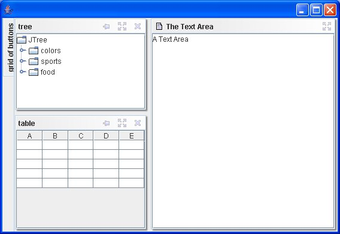
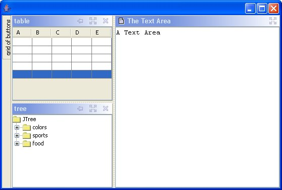
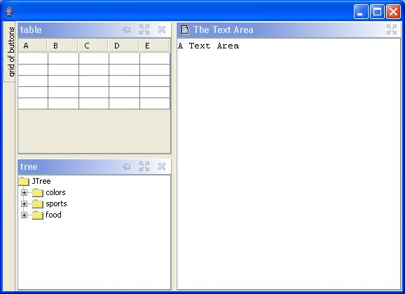

# Lesson 8: Customizing the User Interface

This is the 8th part of the VLDocking Framework for Java Swing applications.
This lesson describes how to change the Look And Feel of VLDocking. 


## The new UI delegation model of VLDocking

### VLDocking UI Delegates


VLDocking uses UI delegate classes to paint the look and feel of many of its components.
Theses classes are dynamically loaded at startup, and use many UI properties to give your application the desired appearance.

Here is the list of the current UI delegates;

| Component             | UI Delegate class                                        |
|=======================|==========================================================|
| `DockView`            | `com.vlsolutions.swing.docking.ui.DockViewUI`            |
| `DockViewTitleBar`    | `com.vlsolutions.swing.docking.ui.DockViewTitleBarUI`    |
| `SplitContainer`      | `com.vlsolutions.swing.docking.ui.DockingSplitPaneUI`    |
| `DetachedDockView`    | `com.vlsolutions.swing.docking.ui.DetachedDockViewUI`    |
| `AutoHideExpandPanel` | `com.vlsolutions.swing.docking.ui.AutoHideExpandPanelUI` |
| `AutoHideButtonPanel` | `com.vlsolutions.swing.docking.ui.AutoHideButtonPanelUI` |
| `AutoHideButton`      | `com.vlsolutions.swing.docking.ui.AutoHideButtonUI`      |


### Replacing UI Delegates


Please note that most UI settings are accessible with UI properties, and thus cas be changed without the need of writing a java class.
The only case where you should have to write your own UI delegate class is when you want a very different rendering (non rectangular for example). 

So, if you need a very different rendering for your dockables, then you will have to provide your custom classes.

Here is how to declare them :

* pre-install the default ui settings in you main() method, or any method prior DockingDesktop usage
* put your new settings as UIManager properties	

Example:

```
public static void main(String[] args){
    // first, preload the UI to avoid erasing your own customizations
    DockingUISettings.getInstance().installUI(); 
    // and start customizing...
    UIManager.put("DockViewTitleBarUI", "your.own.ui.UIDelegateClassName"); 
    // (replaced the DockViewTitleBar UI by another class)
    ...
}
```

### Updating the existing UI

The easiest way to update the UI is by tweaking the UIManager properties.

For example, if you want a special border for maximized dockable, use;
```
// declare your border 
Border myBorder = ...
// put it in the UI property map. 
*UIManager.put("DockView.maximizedDockableBorder", myBorder);*
// and that's it !
```


Please note that *to avoid having your own UI settings beeing erased *by the default ones, you will have to follow the pattern :

* pre-install the default ui settings in you main() method, or any method prior DockingDesktop usage
* put your new settings as UIManager properties	

```
public static void main(String[] args){
    // first, preload the UI to avoid erasing your own customizations
    DockingUISettings.getInstance().installUI(); 
    
    // declare your border 
    Border myBorder = ...
    // and start customizing...
    *UIManager.put("DockView.maximizedDockableBorder", myBorder);*    
    ...
}
```

Now that you know how to proceed, here is the long list of customizable properties ...

## Customizable properties

### Border properties

| UI property                       | type   | effect                                                                   |
|===================================|========|==========================================================================|
| DockView.singleDockableBorder     | Border | border used when the DockView is docked alone (not in a tab)             |
| DockView.tabbedDockableBorder     | Border | border used when the DockView is contained in a tabbed pane              |
| DockView.maximizedDockableBorder  | Border | border used when the DockView is maxmized                                |
| AutoHideButton.expandBorderTop    | Border | Border of the autohide button when it is on top of the desktop           |
| AutoHideButton.expandBorderBottom | Border | Border of the autohide button when it is at bottom of the desktop        |
| AutoHideButton.expandBorderLeft   | Border | Border of the autohide button when it is on the left of the desktop      |
| AutoHideButton.expandBorderRight  | Border | Border of the autohide button when it is on the right of the desktop     |
| AutoHideButtonPanel.topBorder     | Border | Border of the AutoHideButtonPanel when it is on top of the desktop       |
| AutoHideButtonPanel.bottomBorder  | Border | Border of the AutoHideButtonPanel when it is at bottom of the desktop    |
| AutoHideButtonPanel.leftBorder    | Border | Border of the AutoHideButtonPanel when it is on the left of the desktop  |
| AutoHideButtonPanel.rightBorder   | Border | Border of the AutoHideButtonPanel when it is on the right of the desktop |
| DockViewTitleBar.border           | Border | Border of the title bar                                                  |
| ToolBarPanel.topBorder            | Border | Border used when a toolbar in on the top of a container                  |
| ToolBarPanel.leftBorder           | Border | Border used when a toolbar in on the left of a container                 |
| ToolBarPanel.bottomBorder         | Border | Border used when a toolbar in at the bottom of a container               |
| ToolBarPanel.rightBorder          | Border | Border used when a toolbar in on the right of a container                |
| FloatingDialog.dialogBorder       | Border | Border used for the FloatingDialog                                       |
| FloatingDialog.titleBorder        | Border | Border used for the title (drag header) of the FloatingDialog            |


### Color properties

| UI property                      | type  | effect                           |
|==================================|=======|==================================|
| DockingDesktop.notificationColor | Color | blinking color for notifications |

### Icons

| UI property                              | type  | effect |
|====|=======|===|
| DockViewTitleBar.close                   | Icon  | Icon for the close button |
| DockViewTitleBar.close.rollover          | Icon  | Icon for the close button |
| DockViewTitleBar.close.pressed           | Icon  | Icon for the close button |
| DockViewTitleBar.dock                    | Icon  | Icon for the dock button |
| DockViewTitleBar.dock.rollover           | Icon  | Icon for the dock button |
| DockViewTitleBar.dock.pressed            | Icon  | Icon for the dock button |
| DockViewTitleBar.hide                    | Icon  | Icon for the hide button |
| DockViewTitleBar.hide.rollover           | Icon  | Icon for the hide button |
| DockViewTitleBar.hide.pressed            | Icon  | Icon for the hide button |
| DockViewTitleBar.maximize                | Icon  | Icon for the maximize button |
| DockViewTitleBar.maximize.rollover       | Icon  | Icon for the maximize button |
| DockViewTitleBar.maximize.pressed        | Icon  | Icon for the maximize button |
| DockViewTitleBar.restore                 | Icon  | Icon for the restore button |
| DockViewTitleBar.restore.rollover        | Icon  | Icon for the restore button |
| DockViewTitleBar.restore.pressed         | Icon  | Icon for the restore button |
| DockViewTitleBar.float                   | Icon  | Icon for the float button |
| DockViewTitleBar.float.rollover          | Icon  | Icon for the float button |
| DockViewTitleBar.float.pressed           | Icon  | Icon for the float button |
| DockViewTitleBar.attach                  | Icon  | Icon for the attach button |
| DockViewTitleBar.attach.rollover         | Icon  | Icon for the attach button |
| DockViewTitleBar.attach.pressed          | Icon  | Icon for the attach button |
| DockViewTitleBar.menu.close              | Icon  | Icon for the close button, in pop-up menu |
| DockViewTitleBar.menu.hide               | Icon  | Icon for the hide button, in pop-up menu |
| DockViewTitleBar.menu.maximize           | Icon  | Icon for the maximize button, in pop-up menu |
| DockViewTitleBar.menu.restore            | Icon  | Icon for the restore button, in pop-up menu |
| DockViewTitleBar.menu.dock               | Icon  | Icon for the dock button, in pop-up menu |
| DockViewTitleBar.menu.float              | Icon  | Icon for the float button, in pop-up menu |
| DockViewTitleBar.menu.attach             | Icon  | Icon for the attach button, in pop-up menu |
| DockTabbedPane.close                     | Icon  | Icon for the close button, in tabs |
| DockTabbedPane.close.rollover            | Icon  | Icon for the close button, in tabs |
| DockTabbedPane.close.pressed             | Icon  | Icon for the close button, in tabs |
| DockTabbedPane.unselected_close          | Icon  | Icon for the close button, in tabs (for an unselected tab).<br>The "TabbedPane.alternateTabIcons" property must also be set to true |
| DockTabbedPane.unselected_close.rollover | Icon  | Icon for the close button, in tabs (for an unselected tab) |
| DockTabbedPane.unselected_close.pressed  | Icon  | Icon for the close button, in tabs(for an unselected tab) |
| DockTabbedPane.menu.close                | Icon  | Icon for the close button, in tab pop-up menu |
| DockTabbedPane.menu.hide                 | Icon  | Icon for the hide button, in tab pop-up menu |
| DockTabbedPane.menu.maximize             | Icon  | Icon for the maximize button, in tab pop-up menu |
| DockTabbedPane.menu.float                | Icon  | Icon for the float button, in tab pop-up menu |
| DockTabbedPane.menu.closeAll             | Icon  | Icon for the "close all" button, in tab pop-up menu |
| DockTabbedPane.menu.closeAllOther        | Icon  | Icon for the "close all other" button, in tab pop-up menu |


### Labels and Fonts

| UI property                         | type   | effect                                           |
|=====================================|========|==================================================|
| DockViewTitleBar.closeButtonText    | String | Text of the close button |
| DockViewTitleBar.minimizeButtonText | String | Text of the minimize (hide) button |
| DockViewTitleBar.maximizeButtonText | String | Text of the maximize button |
| DockViewTitleBar.restoreButtonText  | String | Text of the restore button(opposite of maximize) |
| DockViewTitleBar.floatButtonText    | String | Text of the float button (detach) |
| DockViewTitleBar.attachButtonText   | String | Text of the attach button(opposite of float) |
| DockViewTitleBar.titleFont          | Font   | Font used by the title bar |
| DockTabbedPane.closeButtonText      | String | Text for the close button in tab |
| DockTabbedPane.minimizeButtonText   | String | Text for the minimize button in tab |
| DockTabbedPane.restoreButtonText    | String | Text for the restore button in tab |
| DockTabbedPane.maximizeButtonText   | String | Text for the maximize button in tab |
| DockTabbedPane.floatButtonText      | String | Text for the float button in tab |

### Displaying buttons in title bars

| UI property | type | effect |
|=====|=====|=====|
| DockViewTitleBar.isCloseButtonDisplayed | boolean | display or not the close button in the title bar (still accessible from pop-up menu) |
| DockViewTitleBar.isHideButtonDisplayed | boolean | display or not the hide button in the title bar |
| DockViewTitleBar.isDockButtonDisplayed | boolean | display or not the dock button in the title bar |
| DockViewTitleBar.isMaximizeButtonDisplayed | boolean | display or not the maximize button in the title bar |
| DockViewTitleBar.isRestoreButtonDisplayed | boolean | display or not the restore button in the title bar |
| DockViewTitleBar.isFloatButtonDisplayed | boolean | display or not the float button in the title bar |
| DockViewTitleBar.isAttachButtonDisplayed | boolean | display or not the attach button in the title bar |

### KeyStrokes

| UI property | type | effect |
|=====|=====|=====|
| DockingDesktop.closeActionAccelerator | KeyStroke | KeyStroke for close action (on selected dockable) |
| DockingDesktop.maximizeActionAccelerator | KeyStroke | KeyStroke for maximize/restore action (on selected dockable) |
| DockingDesktop.dockActionAccelerator | KeyStroke | KeyStroke for hide/dock action (on selected dockable) |
| DockingDesktop.floatActionAccelerator | KeyStroke | KeyStroke for float/attach action (on selected dockable) |

### UI Delegates

| UI property  | type  | effect |
|=====|=====|=====|
| AutoHideButtonUI | class name | UI delegate for the AutoHideButton |
| AutoHideButtonPanelUI | class name | UI delegate for the AutoHideButtonPanel |
| AutoHideExpandPanelUI | class name | UI delegate for the AutoHideExpandPanel |
| DockViewUI | class name | UI delegate for DockView |
| DetachedDockViewUI | class name | UI delegate for DetachedDockView |
| DockViewTitleBarUI | class name | UI delegate for DockViewTitleBar |
| DockViewTitleBar.height | int | Height of the title bars |
| DockingSplitPaneUI | class name | UI delegate for SplitContainer component |
| ToolBarGripperUI | class name | UI delegate for the toolbar "gripper" |

### Cursors

Starting from version 2.0.3 it is now possible to change the mouse cursor images used during drag gestures.

| UI property  | type  | effect |
|=====|=====|=====|
| DragControler.stopDragCursor | java.awt.Image | Image (max 32x32) used when the mouse pointer is above a place where drop is not possible |
| DragControler.detachCursor | Image | Image used to denote a floating action  |
| DragControler.dragCursor | Image | Image used (together with a shape) to denote a position where drop is possible |
| DragControler.swapDragCursor | Image | Cursor image used when doing a drag and drop with Ctrl key ("Hot Swap")  |

### Other properties

| UI property | type | effect |
|=====|=====|=====|
| SplitContainer.dividerSize | int | Divider size of the split panes |
| TabbedDockableContainer.tabPlacement | int (SwingConstants.TOP / BOTTOM) | Global tab style |
| TabbedContainer.requestFocusOnTabSelection | boolean | Automatically puts focus on the selected tabbed component (default false) |
| TabbedPane.otherIconsGap | int | Gap between text and close icon in closeable tab |
| TabbedPane.alternateTabIcons | boolean | allows an alternative set of close icons for selected and unselected tabs (default is false) |
| DockingDesktop.notificationBlinkCount | int | maximum number of blinking for notifications  |
| DockingDesktop.notificationBlinkCount | int | maximum number of blinking for notifications  |
| FloatingContainer.followParentWindow | Boolean | if true, the floating dialogs will follow the movements of their parent window on screen |
| FloatingContainer.paintDragShape  | Boolean | if true, a drag outline shape will follow the mouse when dragging (warning : consumes CPU) |

## The two basic VLDocking styles

VLDocking 1.0 provided a "shadowed" style (similar to the eclipse look and feel).

VLDocking 2.0 comes with a default "flat style" where borders take less space.
It also comes with tabs on top of tabbed containers (version 1.0 had them at bottom).

You can choose select between the following provided styles (more to come) with the methods : 

```
// version 1.0 style
DockingPreferences.setShadowDesktopStyle();
```




```
// or version 1.0 alternative style
DockingPreferences.setDottedDesktopStyle();
```




```
// or version 2.0 default style 
DockingPreferences.setFlatDesktopStyle();
```




----

[Next ; Toolbars](lesson-09.html)

